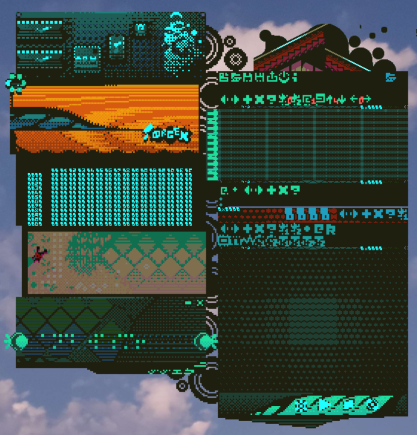

|||
|---------------------------|---------------------------------------------|
|**JiJeq-Orgex** |
|  |  |

Logo and Screenshot of JiJeq-Orgex running on Windows 10.

|||
|---------------------------|---------------------------------------------|
| **Name**            | JiJeq-Orgex (v1.0.0)                            |
| **Developer(s)**            | Nic8Rox Velvet (Savion Nicholls)                              |
| **Started Devlopment** | Feb 1st 2022 (Orgex WoodHouse)  August 10th, 2024 (JiJeq Computer)    |
| **Initial Release** | N/A |
| **Stable Release** | N/A |
|Repository|https://github.com/Nic8RoxVelvet/JiJeq-Orgex|
| **Written in**            | [Rust](https://www.rust-lang.org/)|
| **Operating System**     | [Cross-Platform](https://en.wikipedia.org/wiki/Cross-platform_software) |
| **Available in**     | English, Japanese |
| **Type**                | [Digital audio workstation](https://en.wikipedia.org/wiki/Digital_audio_workstation), [Live coding environment](https://en.wikipedia.org/wiki/Live_coding), [Tracker](https://en.wikipedia.org/wiki/Music_tracker), [Experimental music](https://en.wikipedia.org/wiki/Experimental_music), [MIDI](https://en.wikipedia.org/wiki/MIDI), [Source code editor](https://en.wikipedia.org/wiki/Source-code_editor), [Hex editor](https://en.wikipedia.org/wiki/Hex_editor) |
| **License**	|[Proprietary](https://en.wikipedia.org/wiki/Proprietary_software)|
| **Filename Extensions**               | *.rolleq, *.asmm (read-only) |
| **Website** | N/A |
| **Motto**               | "Low-level generative music with control!" |

**JiJeq-Orgex** (**aka Jijeq Computer x Orgex WoodHouse**) is a closed-source, experimental, low-level, 2-D generative music DAW driver hybrid for PC and browser (via WASM) programmed in Rust by Nic8Rox Velvet that supports SDL2 as a backend. 
It's a merge between Orgex WoodHouse and Jijeq Computer.

It's a combination of MIDI, trackers, procedural, two-dimensional interfaces of Minesweeper, Befunge and ORCA (100rabbits), Seq24, Max/Msp, raw assembly (like ARM), and Emotion visuals and quirks. It processes in real-time for playback. Both Jijeq and the cancelled Orgex Woodhouse were spiritual successors to LoCri+ (Started on Jan 15th, 2020 and ended on July 2021), and his 2nd major Rust project after the cancelled Orgex Woodhouse port. Like the early version of LoCri before the change, it features a transparent widget style that resembles KWGT and Rainmeter and it spawned an abstract Rack-based Wooden/Minimalism pixel art style.

JiJeq will handle the minimal VScode art, RoboEmoto, The braille system, oscilloscope, hex editor, tracker view, blending mode effects, interaction with eyes by using the mouse, compiling assembly code and the Hive Executer/Otto Tracker system, while Orgex handle Wooden art themes, and editing music (MIDI-1 and MIDI-2) in a midi/tracker style.

The Goal for this project is to create either impressive music or generative/interactive music utilizing strange and unusual music file formats (depending on the composer's choices) with assembly-esque and memory saving trick & techniques. In addition, it can gain access to all of the registers from the custom sound chip. Most of these files can be compiled for playback live. It is, by design, a musical playground for programmers, livecoders, composers/arrangers and musicians.

<b>Contents</b>

1. [Early Names](#pg0)
2. [Planned Compositions](#pg1)
3. [History](#pg2)
4. [Features](#pg3)
5. [Structure](#pg4)
6. [HIVE EXECUTER/OTTOTRACKER](#pg5_5)
7. [Jijeq File Format](#pg5)
8. [Custom Assembly Language](#pg6)

# Early Name
- Velvet
- IGRI
- AGpa
- Orgex
- Orgex Woodhouse
- Orgex Woohouse Pocket Zwei (final name for the standalone app before it was cancelled)
- IDEQ-MIMUQ
- MemoryMiniMusic-Qe1
- MMQ1
- MMQE1
- MM-Qe1 
- MMQToy
- EyeMM-Q 
- eMMQ 
- KroQ-C 
- Ecq-M 
- Hyvx 
- Eniq
- 8-Eyma 
- 8-Eye 
- Emma 
- 8Eye 
- N8RV-MMQToy Alpha 
- 8Hau / FloreQ 
- eMMQ x Hyvex 
- Jijeq
- eMMQ1
- Jijeq Computer (final name being briefly considered before the name got scrapped after the merger was completed)
- JYJQ
- Jijeq-Orgex
- OrJeq / OrJeq Computer 
- OrJeq-C (Organic Jijeq Computer)
- OrJeq-ASMM (Organic Jijeq Assembly Music)
- JiJeq x Orgex
- Jijeq Computer x Orgex WoodHouse

#Planned Compositions
|Songs|Audio Drivers|Release|
|-|-|-|
|Orciyami|OrJeq-C|2026|
|LimaDice|OrJeq-C/Novek|2026|
|GpEi|OrJeq-C|N/A|
|Etude de DQre WoodHouse|OrJeq-C|N/A|
|Antway|OrJeq-C|N/A|
(Note: a brand new soca music project in development Initially planned to be the first compositons to be done in Jijeq, but due to the Orgex/Jijeq merger, it will become the 2nd. It will be experimental soca Afrobeat-inspired Fusion hybrid, will be the only known major soca project to be made for it.)

Planned Test Experiments:
- MTV3 Finland 1970
- Paris Match - Red Shoes 
- Nisse
- Espresso
- Cardcaptors (GBC)
- Jura
- etc

## History/Development:
 The development for Orgex for the program started on February 1st, 2022 as a simple Deflemask parser to analysis the deflemask file format. The UI ideas including some early icons were development and finished betwwen Summer 2022 to November 2022. The first iteration of Orgex have a completely early radical UI design inspired by large N64 devcarts and it was originally colored in beige before it changes to red/magenta.  However, once the code, graphics and the player was completed, it was later scrapped due to the Genesis music era ended in 2023 and most of the code and graphics from the 1st version was reused for the 2nd iteration. After Discovering some generative music programs like Orca, Max/Msp, Pure Data and ChucK, the direction of the software has changed significantly. Jijeq, however, was originally started on August 10th, 2024 as an simple alternative to the Orgex Woodhouse DAW due to Orgex was overbloated with too many MML ideas. It was originally called eMMQ and later Jijeq Computer. It was initally goign to have a minimalistic VScode-esque style in contrast to Orgex, which most of its visual cues were reused from a now-completed alarm clock. It was planned to be exclusively made for composition experiments, studies and soca music exclusively. However, On December 9th, 2024, due to the development of Jijeq went smoothly than expected, Orgex WoodHouse as a standalone program was cancelled after two years of development (Feb 1st 2022 to Dec 9th, 2024) and merged with Jijeq, and the minimal artsyle inspired by VS code was abandonded shortly after. It was renamed to OrJeq on December 11th, 2024 after the merger was completed. But it is called JiJeq-Orgex now.

# Features/Goals 
- low-level control for music compositions
- to make compositions in a ridiculously small file size
- To be the most advanced and most user-friendly program.
- To have an RoboEmoto engine for emotional situations
- To have a Rack-based Woodenen theme with a minimal/Aero/Techno art direction done in a pixel art style
- featuring a very powerful virtual soundchip called Orgex-1 
- To be DX7/YM2612 compatible and Gain all access to almost all registers
- To be small and lightweight like a handheld on the PC.
- Have both MIDI, WAV and compiled JijeqStream export.
- An experimental & blocky graphic notation style for organizing/planning out compositions/arrangements,replacing the Amiga tracker/spreadsheet/timeline system.
- To render all of the selected and HIVE data into a RAM for playback
- To make a few projects exclusively to it.
- Unlimited number of MIDI-1, MIDI-2, MACROS and HIVE

# Procedural Structure

1) Edit music through MIDI-1 and MIDI-2 (with Macros)

  MIDI-1 is basically a simpler sequencer format that consists of note types, note ranges and macros. It is designed to edit music sequences in a tracker-like style. The structure of sequences is similar to trackers such as Ultimate Soundtracker, Fasttracker, Protracker and OctaMED but with macros instead. Unlike the early version of Orgex, 8-palettes are nowhere to be found in order to save RAM resources upon using the program.

  MIDI-2, by contrast, is a music idea format that can store either melodic fragments, motives and other purposes what can be later modified by the MIDI-2 editor. The structure is related and similar to MIDI-1 but with reduced features.

2) compiles to one of the following before your press the player button:
    -all ARM-esque assembly macros 
    -selected HIVE objects 
    -pre-built SOCCA code
    -Raw assembly music code
- each matrix has there own HIVE stack pointer

3) Hive Executer [ハイブエグゼキューター] (a grid executer inspired by Max/Msp, ORCA, Minesweeper, Seq24, TidalCycles)
- hardcoded 32x32 size (size can't be changed)
- run on its own thread
- Bang must be at a X:0 & Y:0, otherwise it will skip the executing process 
- Every object can be exceuted once, to a max row number, or unlimited amount of it. 
- Each object have their own unique ID for communication with assembly code
- ARM Macro/Script: execute ARM-esque assembly code (procedural stuff) (optional)
    - it has 3 RAMs and an unusual instruction set
- Rolleq Box: gather MIDI-1/MIDI-2 information (note, note idea, pitch, volume, macro1-2, etc) and sends to tracker object on selected channel (optional)
- Macro3-4: gathring information from efxs param/command and sends to tracker object (optional)
- Beats: take pre-built soca/calypso rhythms and send to tracker object (optional)
- RAW: take raw assembly music code (note)
- BOMB: unknown purpose
- 1+: unknown purpose
- 2+: unknown purpose
- 3+: unknown purpose
- 4+: unknown purpose
- 5+: unknown purpose
- 6+: unknown purpose
- 7+: unknown purpose
- 8+: unknown purpose

4) Otto-Tracker (An eight-row tracker player for playing number of channels that gathers music,volume, instrument, and commands )
    - position 0 play selected notes from channels
    - position 1 sustain or none
    - position 2 rest for all notes
    - position 3 
    - position 4
    - position 5 
    - position 6 
    - position 7 crash the player
    
- run on its own thread
- must have a bang occur from HIVE and resets to position 0 (if there's no bang occur, it will stay at position 1)
- play sounds from a number of channels. 
One all of the notes are done playing, it will send back to the Hive Executer.
- increase row position to 1 after it plays

5) Flip Flops Hive Executer and Drei-Tracker, until the max row moves to the next matrix, repeats, or ends

6) Repeat process

6) One the Player ends, all 3 RAMS,HIVE objects and compiled ARM code will be cleared until you compile them again for another playback.

### HIVE EXECUTER/OTTOTRACKER:

    ----HEX object
    Data1
    bit 15-11 X (x coordiate)
    bit 10-6 Y (y coordiate)
    bit 5-2 CH (channel)
    bit 1-0 Reserved

    Data2
    bit 15 active (on by default)
    bit 14 once (on by default if note present set to 1)
    bit 13 looping (on by default if note present set to 2)
    bit 12 delay mode
    bit 11 shutdown mode
    bit 10 random mode
    bit 9 mute mode
    bit 8-0 reserved

    Unique ID - 0 - 255
    Object ID - 0-255
    Objtype - 0-2

    Row/Total rom 0-255 //totalrow during playback (if currow > totalrow)
    RowM/Row Max 0-255 //
    Rowadd 0-16 //
    Transpose //
    Ticks 0-3 increase Row

    Start Offset 0-255
    End Offset 0-255

    Once 0-1
    Delay 0-65535
    Shutdown 0-65535 (won't work during delay mode)
    Value/Value ID 0-65535

    ----FLAGS
    bit 15 active
    bit 14 once 
    bit 13 looping/repeat 
    bit 12 delay mode
    bit 11 shutdown mode

    ----LIST OF OBJECTS
    0x00: Bang (mandatory)
    0x01: Bang+ (mandatory)

    0x08 Decimel/Hex Value
    0x09 Register
    0x0A Value

    0x10: Rolleq (MIDI1 & MIDI2)
    -> unique id? yes, type:0, value: 0x0000 - 0xfffe
    
    0x11: Macro 3
    -> unique id? yes, type:0, value: 0x0000 - 0xfffe

    0x12: Macro 4
    -> unique id? yes, type:0, value: 0x0000 - 0xfffe

    0x13: Instrument
    -> unique id? yes, type:0, value: 0x0000 - 0xfffe

    0x14: Beats
    -> unique id? yes, type:0, value: 0x0000 - 0xfffe

    0x15: Random Note
    -> unique id? yes, type:0, value: 0x0000 - 0xfffe

    0x1A: Repeat/Looping
    0x1B: Delay
    0x1C: ShutDown
    0x1D: Frame (unused; no purpose)
    0x1E: Active

    -> unique id? No, type:0, value: 0x0000 - 0x0008
    If active Affects: entire grid

    0x1E: Raw

    0x1F: ARM Macro Script
    -> unique id? Yes, type:0, value: 0x0000 - 0xfffe
        If active Affects: None (Full Control only)

    

# File Format:

    <<START OF JIJEQ FORMAT>>
    "JIJEQ" (Header 5 bytes)
    checksum (8 bytes)
    >Version (1 byte)
    >chip (1 byte)
    >bank (1 byte)
    >BPM (2 byte)
    >TICK1 (1 byte)
    >TICK2 (1 byte)
    >Total Data1 (2 bytes) 
    >Total Data2 (2 bytes)
    >Total Data3 (2 bytes)
    >Total Data4 (2 bytes)
    >Total Data5 (2 bytes)

    "@MIDI-1" (6 bytes) [ID]
        ::Repeat of Data1::
            >Name Length (1 byte)
            >Name (# bytes) MAX OF 16 BYTES
            >Total notes (2 bytes)
            >Total Macros (2 bytes)

            ::repeat Total notes::
                >NOTES (3 bytes)
                    - Position (bit 23-16) [8-BIT] xxxxxxxx   
                    - InstrumentFlag (bit 15) [1-BIT] x
                    - Reserved (bit 14-10 ) [5-BIT] xxxxx
                    - NotePresentType (bit 9-7) || 0 - none, 1 - Note, 2 - Idea, 
                    - Octave (bits 6-4) xxx
                    - NOTE (bits 3-0) xxxx (0-12 C-B | 15-rest)
                >IDEE Value (2 bytes)
                    - Value [16-BIT] || if NotePresentType set to 2
                >instrument Value (1 bytes)
                    - Value [8-BIT] || if InstrumentFlag set to 1 
            ::end of repeat Total notes::

            ::repeat Macro notes::
                >NOTES (2 bytes)
                    - Position (bit 15-8) [8-BIT]
                    - MacPresent (bit 7) 
                    - MacV1Pre(bit 6)
                    - MacV2Pre(bit 5)
                    - Unused (bits 4-0)	
                >Value1 (2 bytes) [16-BIT] || If MacV1Pre set to 1 
                >Value2 (2 bytes) [16-BIT] || If MacV2Pre set to 1 
            ::end of repeat Macro notes::
    ::End repeat of Data1::

    "@MIDI-2" (6 bytes) [ID]
        ::Repeat of  Data2::
            >Name Length (1 byte)
            >Name (# bytes)
            >Total notes (2 bytes)

            ::repeat Total notes::
                >NOTES (3 bytes)
                    - Position (bit 23-16) [8-BIT] xxxxxxxx   
                    - InstrumentFlag (bit 15) [1-BIT] x
                    - Reserved (bit 15-10 ) [6-BIT] xxxxxx
                    - NotePresentType (bit 9-7) || 0 - none, 1 - Note,  2- Notefixed, ? - Note w/Inst, xx
                    - Octave (bits 6-4) xxx
                    - NOTE (bits 3-0) xxxx (0-12 C-B | 15-rest)
                >instrument Value (1 bytes)
                    - Value [8-BIT] || if InstrumentM set to 2 
            ::end of repeat Total notes::

    ::End repeat of  Data2::

    "@MAC" (4 bytes) [ID]
        ::Repeat of Data3::
            >Name Length (1 byte)
            >Name (# bytes)
            >Repeat(bit0)/row(bits1-7)
                ::Repeat of row::
                    Command (2 bytes)
                    Param (2 bytes)
                ::End repeat of row::
    ::End repeat of Data3::

    "@MTRX" (5 bytes) [ID]
        ::Repeat of Data4::
            >matrix (2 bytes)
        ::End repeat of Data4::

    "@HIVE" (5 bytes) [ID]
        ::Repeat of Data5:: (Width 32 and Height 32 by default)
            >Name Length (1 byte)
            >Name (# bytes)
            >ROW (2 byte)
            >Repe(bit15 enable/disable | bits14-0 times) (2 bytes)
            >totalgrid (2 bytes)
                ::Repeat of X&Y::
                    >xydc (2 bytes)
                      - datatypePresent (bits 15-14)  xx | 0-none 1-objectSP 2-object2 3-????|
                      - X (bits 13-9) xxxxx (fixed)
                      - Y (bits 8-4)  xxxxx (fixed)
                      - Channel (bits3-0) xxxx
                    >uniq (1 byte)
                    >ObjectID (1 byte)
                    >Value/ID (2 bytes)
                ::EndRepeat of X&Y::
        ::End repeat of Data5::

    <<END OF Jijeq FORMAT>>

    use your custom key and then compress it in zlib.

### Custom Assembly Language:
    Features
       - Quad Memory
       - 1024 bytes for Memory 1
       - 2048 bytes for Memory 2
       - 65536 bytes for Memory 3
       - 65536 bytes for Memory 4
       - 16 16-bit registers (both general purpose and  indexing)
  
    Memory (1st ram)
       - 0x0000-0x01ff -general purpose
       - 0x200-0x23f - UQ0 to UQ31 (16-bit for each)
       - 32-bit Current Date (0x03e0-0x03e3)
       - 32-bit Start Date (0x03e4-0x03e7)
       - 32-bit Date Glitch (0x03e8-0x03eb)
       - 32-bit Date End (0x03ec-0x03ef)
       - 0x03fe-0x03ff - 16-bit random number generator
    
    Memory (2nd ram)
      - 0x0000-0x07ff -general purpose

    Memory (3rd ram)
      - 0x0000-0xffff - music data of any kind / general purpose

    Memory (4th ram)
      - 0x0000-0xffff - music data of any kind / general purpose

    Registers:
      - REG0-REG15 //General purpose / Indexing

    Unique variables 0x200-0x23f (16-bit for each / 1st ram only):
      - UQ0 //Active (0x200-0x201)
      - UQ1 //Looping (0x202-0x203)
      - UQ2 //Delay (0x204-0x205)
      - UQ3 //Shutdown (0x206-0x207)
      - UQ4 //Random (0x208-0x209)
      - UQ5 //SOFF (0x20A-0x20B)
      - UQ6 //EOFF (0x20C-0x20D)
      - UQ7 //Channel  (0x20E-0x20F)
      - UQ8 //Once (0x210-0x211)
      - UQ9 // (0x212-0x213)
      - UQ10 // (0x214-0x215)
      - UQ11 // (0x216-0x217)
      - UQ12 // (0x218-0x219)
      - UQ13 // (0x21A-0x21B)
      - UQ14 // (0x21C-0x21D)
      - UQ15 // (0x21E-0x21F)
      - UQ16 // (0x220-0x221)
      - UQ17 // (0x222-0x223)
      - UQ18 // (0x224-0x225)
      - UQ19 // (0x227-0x227)
      - UQ20 // (0x228-0x229)
      - UQ21 // (0x22A-0x22B)
      - UQ22 // (0x22C-0x22D)
      - UQ23 // (0x22E-0x22F)
      - UQ24 // (0x230-0x231)
      - UQ25 // (0x232-0x203)
      - UQ26 // (0x234-0x205)
      - UQ27 // (0x236-0x207)
      - UQ28 // (0x238-0x209)
      - UQ29 // (0x23A-0x20B)
      - UQ30 // (0x23C-0x20D)
      - UQ31 //Main Value (0x23E-0x23F)

    Others:
        ; - comment
        @ - label

    Instruction Set:
      - NOP
        - e.g. NOP
      - MVE 
      - e.g. MVE REG0 #$0000
      - e.g. MVE REG0 REG1
      - e.g. MVE REG0 ?1$0000
      - e.g. MVE REG0 ?2$0000
      - e.g. MVE REG0 ?3$0000
      - e.g. MVE REG0 ?4$0000
    - LAD 
      - e.g. LAD REG0 ?1$0000 REG1
      - e.g. LAD REG0 ?2$0000 REG1
      - e.g. LAD REG0 ?3$0000 REG1
      - e.g. LAD REG0 ?4$0000 REG1
    - STR 
      - e.g. STR REG0 ?1$0000
      - e.g. STR REG0 ?2$0000
      - e.g. STR REG0 ?3$0000
      - e.g. STR REG0 ?4$0000
    - STRIDX
      - e.g. STR REG0 ?1$0000 REG1
      - e.g. STR REG0 ?2$0000 REG1
      - e.g. STR REG0 ?3$0000 REG1
      - e.g. STR REG0 ?4$0000 REG1
    - PSH1 
      - e.g. PSH1 REG0
    - POP1 
      - e.g. POP1 REG0
    - same appiled to PSH2,POP2,PSH3,POP3,PSH4,POP4,

    - ADD + 
      - e.g. ADD REG0 REG0 #1
      - e.g. ADD REG0 REG0 #$7f
      - e.g. ADD REG0 REG0 REG1
      - e.g. ADD REG0 REG1 REG2
      - e.g. ADD REG0 REG1 #$7f
      - e.g. ADD REG0 REG1 @1$0000
      - e.g. ADD REG0 REG1 @2$0000
      - e.g. ADD REG0 REG1 @3$0000
      - e.g. ADD REG0 REG1 @4$0000

    - same examples for all of these
      - SUB -
      - MUL *
      - DIV /
      - MODU %
      - AND &
      - ORR |
      - XOR/EOR ^
      - LSL <<
      - ASR >>
      - ROL <<<
      - ROR >>>
      - NOT ~ or !(if you ar using Rust)

    - CMP 
      - e.g. CMP REG0 REG1
      - e.g. CMP REG0 #$7f
      - e.g. CMP REG0 #1
      - e.g. CMP REG0 $0000
    - TST 
      - e.g. TST REG0
    - BTST 
      - e.g. BTST REG0 #7

    - BREQ $0000
    - BRNE $0000
    - BRGE $0000
    - BRGT $0000
    - BRLT $0000
    - BRLE $0000

    - BRA 
      - e.g. BRA $0000
    - CLL 
      - e.g. CLL $0000
    - BXLR 
    - BRK 
    - HALT 
    - EXIT 

    - SPECIAL INSTRUCTIONS:
    - UNIQ_ON 0 //Turn on unique object via active
    - UNIQ_OFF 0 //Turn off unique object via active

    - UNIQ_OUT 0 //send seleted UQ memory datas to unique hex object id for changes
      - E.G. UNIQ_OUT [unique id] [imm]

    - UNIQ_OUTALL 0 //send UQ0-UQ31 memories to unique hex object id for changes
      - e.g. UNIQ_OUTALL 0

    - SKPML //skip to previous matrix
    - SKPMR //skip to next matrix
    - SKPMTO 0-FFFF //skip to selected matrix
    - FRZ //freeze grid until reset once the currow is in max
    - CRSH // crash grid
    - CLRR // clear all general purpose registers (R0-R15)
    - CLRU // clear all unique variables (UQ0-UQ31 rams)
    - CLRM1 //
    - CLRM2 //
    - CLRM1S //
    - CLRM2S //
    - LD_UNIQ // load unique object type e.g. LD_UNIQ R0 [unique number] [type (like Once, delay, etc)]   
    - KILL // deactivate all objects (no matter what unique id they have)

### EXAMPLES:
    MOV R0, #00
    @LOOP:
        CMP R16,#0xff
        BEQ MEEM
        ADD R16,$100
        JMP LOOP
    @MEEM:
        SNDUQ R16
        MOV R0, #00
        RTN 

### A MORE COMPLEX EXAMPLE:
    # FAKE PRIMITIVE PSEUDO-RANDOM GENERATED CODE BY NIC8ROX VELVET

        @init
            CLRU
            CLRR
            CLRM1
            CLRM2

        @start
            MVE REG0 #$ffff
            STR REG0 ?1$0000

        @loop

    # if R6 == 112 {end()}
            CMP REG6 #112
            BREQ end

    # R0 = mem1[0-1]
            MVE REG0 ?1$0000

    # R0>>0 -> R0>>2 -> R0>>3 -> R0>>5 ->
            ASR REG1 REG0 #0
            ASR REG2 REG0 #2
            ASR REG3 REG0 #3
            ASR REG4 REG0 #5

    # R1 = ((R0 >> 0) ^ (R0 >> 2) ^ (R0 >> 3) ^ (R0 >> 5)) & 1;
            XOR REG1 REG1 REG2
            XOR REG1 REG1 REG3
            XOR REG1 REG1 REG4
            AND REG1 REG1 #1

    # (R0>>1)
            ASR REG0 REG0 #1
    # (R1>>1)
            LSL REG1 REG1 #$0f

    # R0 = (R0>>1) | (R1<<15)
            ORR REG0 REG0 REG1

    # R0 &= 0xffff
            AND REG0 REG0 #$ffff

    # mem1[(R7)-(R7+1)]=R0&7
    # R7 += 2
    # R6 += 1

            STR REG0 ?1$0000 
            #AND REG0 REG0 #$07
            STRIDX REG0 ?1$0020 REG7
            ADD REG7 REG7 #$02
            ADD REG6 REG6 #$01
            BRA loop

        @end
                CLRR

    # check for bit 1
        @end1
                CMP REG6 #112
                BREQ end2
                LAD REG0 ?1$0020 REG7
                BTST REG0 #1
                BRNE end2
                ADD REG7 REG7 #$02
                ADD REG6 REG6 #$01
                BRA end1

        @end2
    # store location and number
                MVE REG14 REG7
                ADD REG14 REG14 #$20
                LAD REG15 ?1$0020 REG7
                CLRM1S ?1$0000 #$E0
                CLRM2S ?2$0000 #$E0
                BRK

# Contact
  - gmail: [nic8roxvelvet@gmail.com](mailto:nic8roxvelvet@gmail.com)